# Конкурс проектов "Время IT"

В рамках данного хакатона была разработана серверная часть для мобильного приложения
для онбординга сотрудника. По итогам хакатона мы с командой заняли 1 место.
---
[Диплом победителя](other/Диплом%20I%20степени,СыворотневВС,Конкурс.pdf) \
[Полная презентация продукта](other/suaiProjectCompetiotion.pdf)
---
### Технологический стек:
* Python
* Flask 
* Psycopg
* Postgresql
* Docker
* Docker-compose
---

  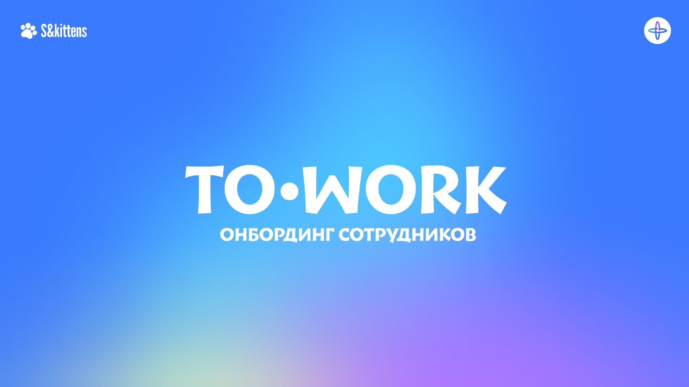

  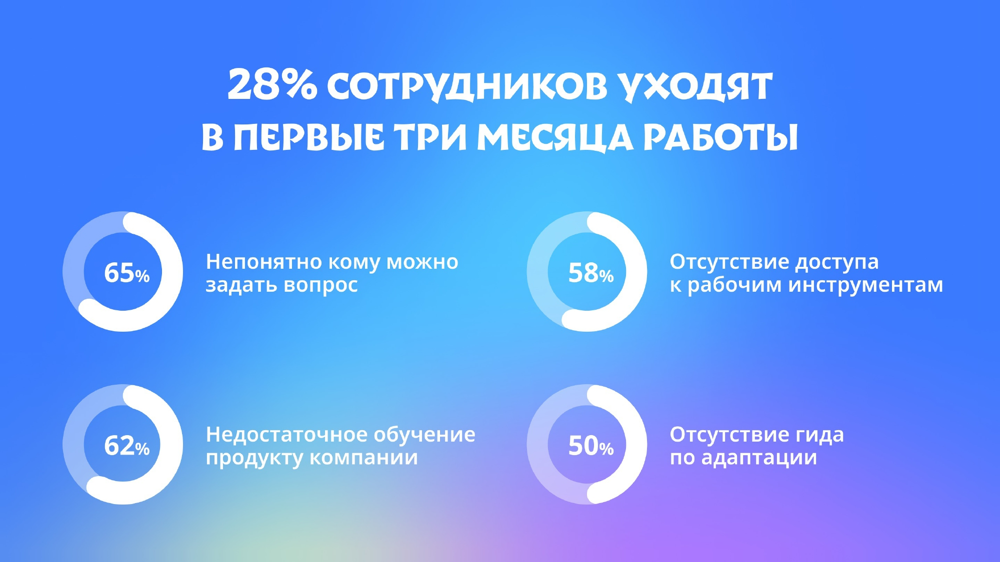

  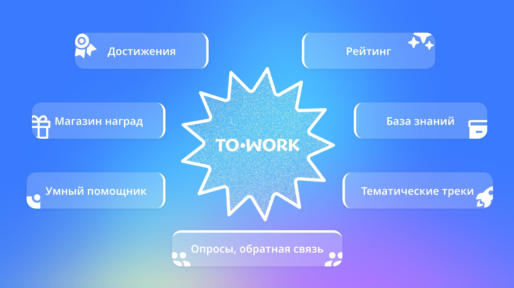

  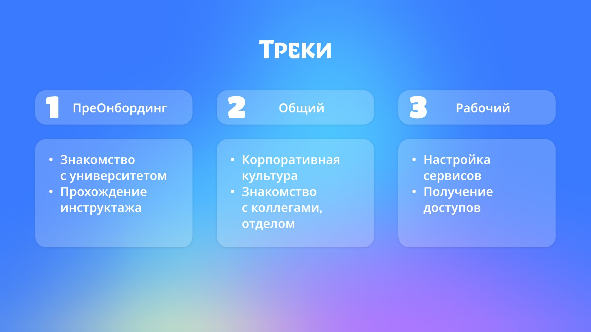

  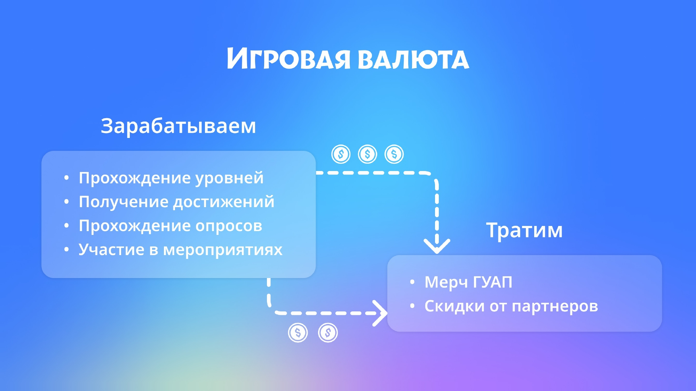

  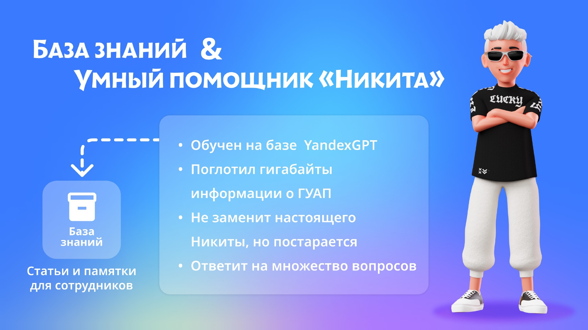

  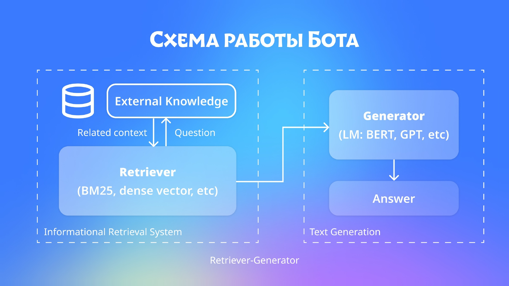

  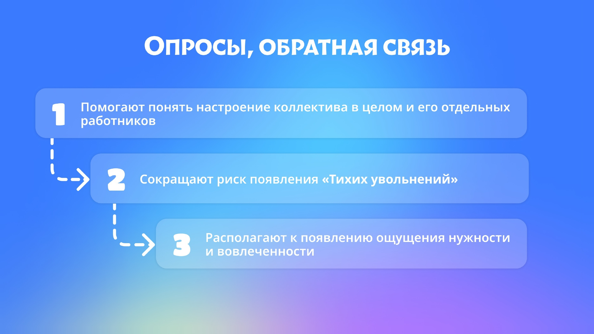

  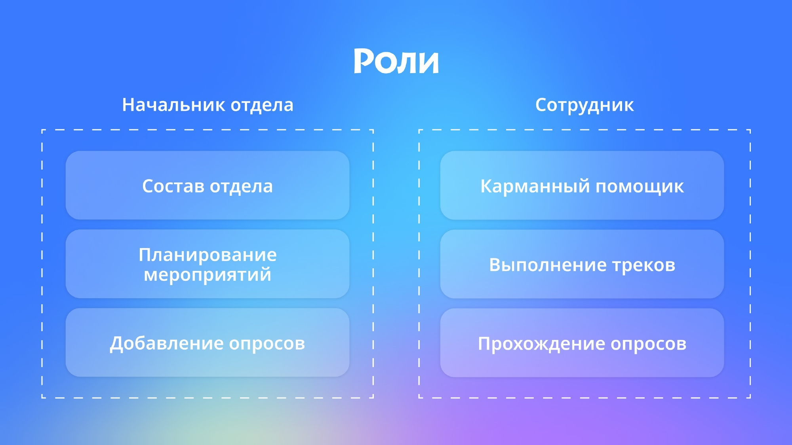

  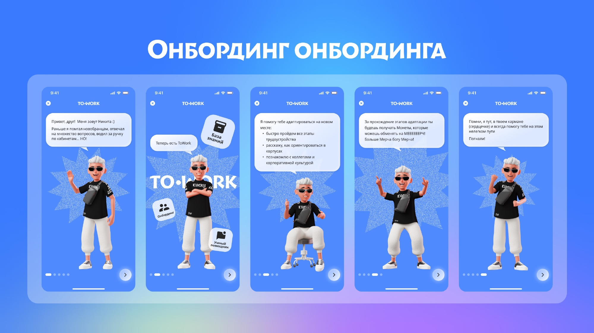

  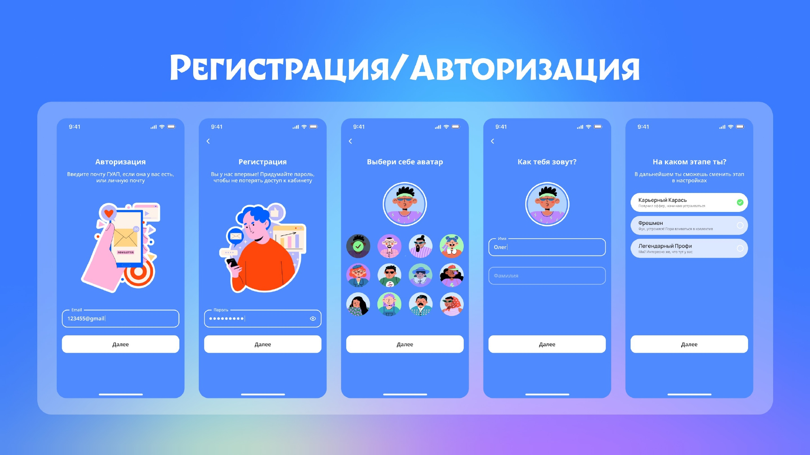

  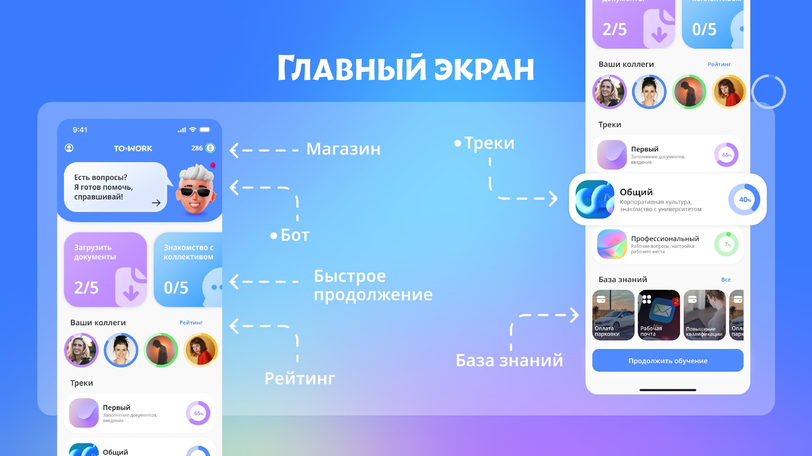

  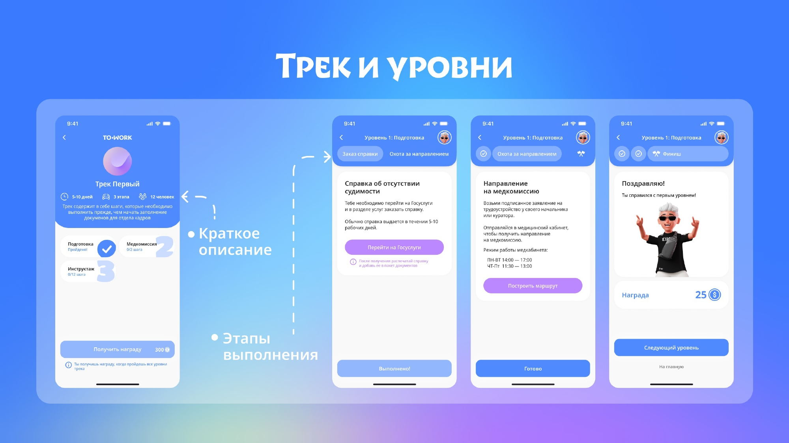

  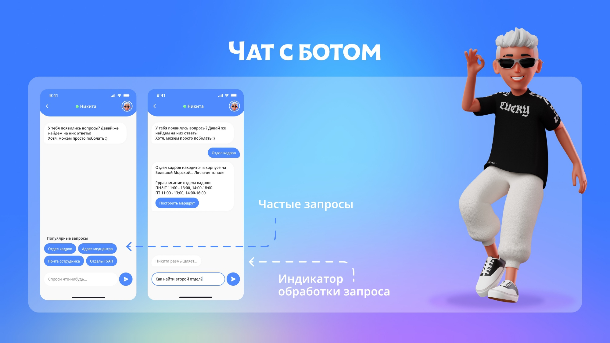

  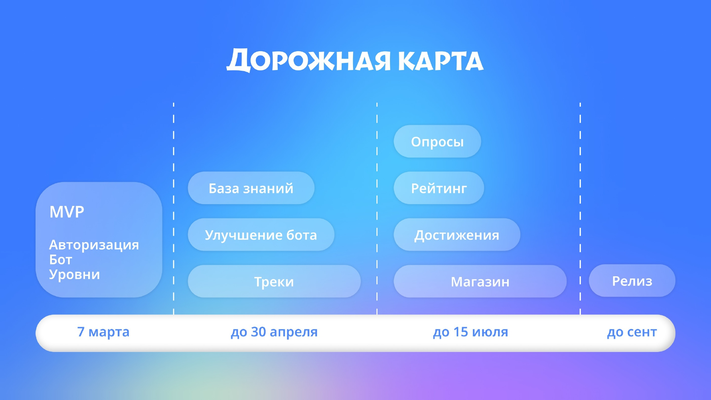

  

---